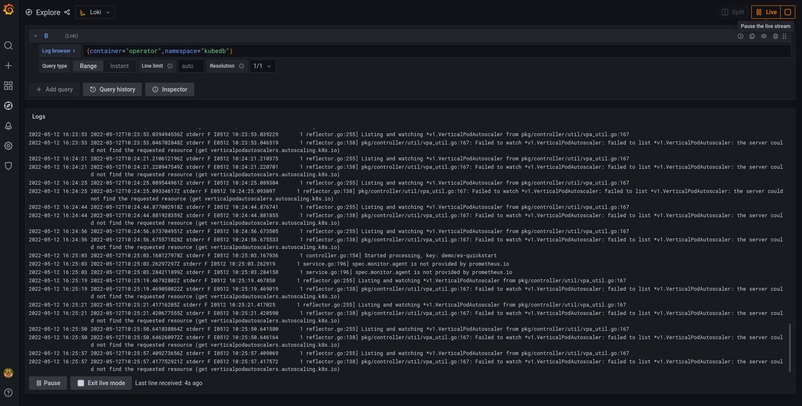
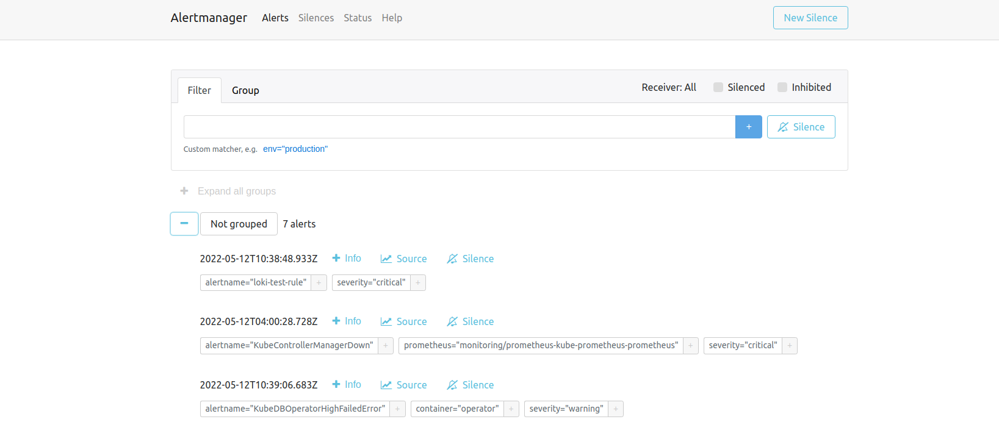
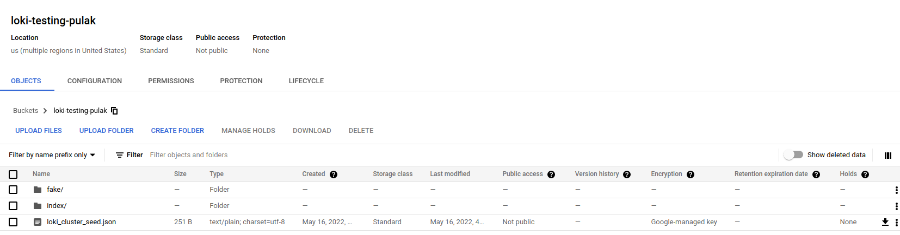

# grafana-loki-setup

Grafana Loki Setup Guide in Kubernetes

## Single Tenent Model (Using DaemonSet for Log Collector Client(Fluent bit))

1. Install Grafana loki-distributed chart in loki namespace. It will install loki's mircoservice components.

```bash
helm repo add grafana https://grafana.github.io/helm-charts
helm repo update
helm upgrade --install loki grafana/loki-distributed -n loki --create-namespace --values=sample-values.yaml
```

2. Install Fluent bit for collecting log with proper loki service name.

```bash
helm upgrade --install fluent-bit grafana/fluent-bit -n loki \
                      --set loki.serviceName=loki-loki-distributed-distributor.loki.svc
```

3. Port forward grafana service & add loki data source. After that from `Explore` section in grafana UI, logs can be examined.

Sample:




4. For getting alert configure alert_manager url in `.values.loki.config` section & add necessary rules in `.values.ruler.directories` sections.

Sample rules file:
```yaml
rules.yaml:
  groups:
  - name: should_fire
    rules:
      - alert: KubeDBOperatorHighFailedError
        expr: sum by (container) (rate({namespace="kubedb"} |= "Failed"[1m])) > 0.0001
        for: 1m
        labels:
            severity: warning
        annotations:
            summary: High failed error
  - name: test-rule
    rules: 
      - alert: loki-test-rule
        annotations: 
          message: "testing loki rules"
        expr: 1+1
        for: 1m
        labels: 
          severity: critical
```

Alert in AlertManager UI:



## Setup Loki with GCS as an object storage

1.Prepare secret with GOOGLE_APPLICATIONS_CREDENTIALS.

Example:
```bash
kubectl create secret generic -n loki gcs-secret \
                    --from-file=./GOOGLE_SERVICE_ACCOUNT_JSON_KEY
```

2. Configure Loki's valuse file for gcs object storage.

Sample `.values.loki.schemaConfig`:

```yaml
  schemaConfig:
    configs:
    - from: 2020-09-07
      store: boltdb-shipper
      object_store: gcs
      schema: v11
      index:
        prefix: loki_index_
        period: 24h
```

Sample `.values.loki.storageConfig`:

```yaml
  storageConfig:
    boltdb_shipper:
      shared_store: gcs
      active_index_directory: /var/loki/index
      cache_location: /var/loki/cache
      cache_ttl: 168h
    gcs:
      bucket_name: loki-testing-pulak
```

Sample `.values.ingester` section to load gcs secret path as an env.

```yaml
ingester:
  ...
  ...
  extraEnv:
    - name: GOOGLE_APPLICATION_CREDENTIALS
      value: /var/secrets/google/GOOGLE_SERVICE_ACCOUNT_JSON_KEY
  # -- Environment variables from secrets or configmaps to add to the ingester pods
  extraEnvFrom: []
  # -- Volume mounts to add to the ingester pods
  extraVolumeMounts:
    - name: google-cloud-key
      mountPath: /var/secrets/google
  # -- Volumes to add to the ingester pods
  extraVolumes:
    - name: google-cloud-key
      secret:
        secretName: gcs-secret
  ...
  ...
  persistence:
    # -- Enable creating PVCs which is required when using boltdb-shipper
    enabled: true
    # -- Size of persistent disk
    size: 10Gi
    # -- Storage class to be used.
    # If defined, storageClassName: <storageClass>.
    # If set to "-", storageClassName: "", which disables dynamic provisioning.
    # If empty or set to null, no storageClassName spec is
    # set, choosing the default provisioner (gp2 on AWS, standard on GKE, AWS, and OpenStack).
    storageClass: standard
```

A full working values file `loki-sample-values-file.yaml` is given for example.
If everything goes well, then data will be stored in gcp bucket like this:



Note: Here GCS bucket will hold the index data as well as compressed log data. BoltDB shipper will upload the new files in every 15 min interval. So, to avoid data loss in case pod crash, ingester should be run with persistence data storage. (Ref: https://grafana.com/docs/loki/latest/operations/storage/boltdb-shipper/)

### References

- https://grafana.com/docs/loki/latest/
- https://github.com/grafana/loki
- https://github.com/fluent/fluent-bit
- https://docs.fluentbit.io/manual

